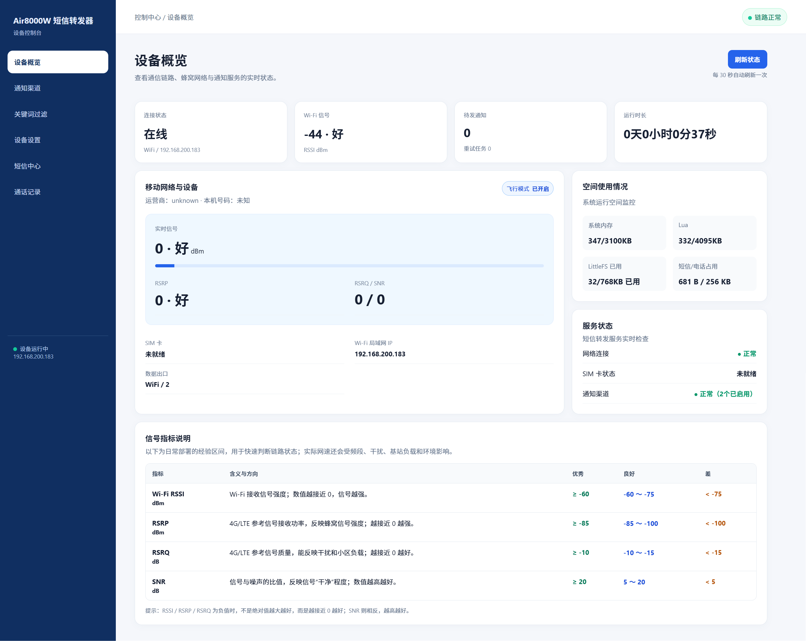
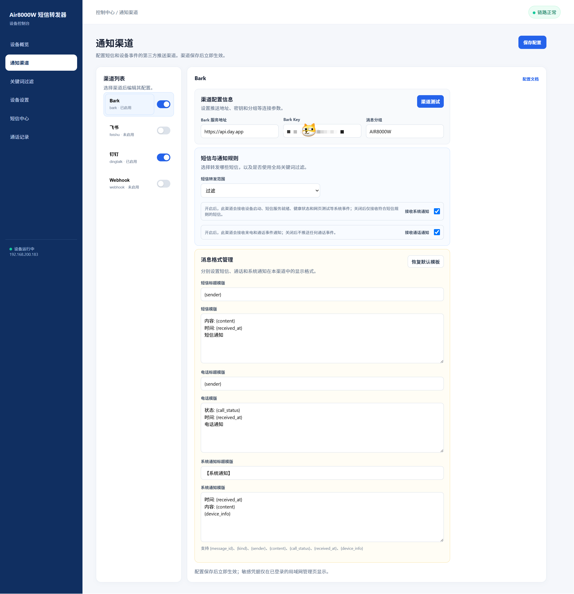
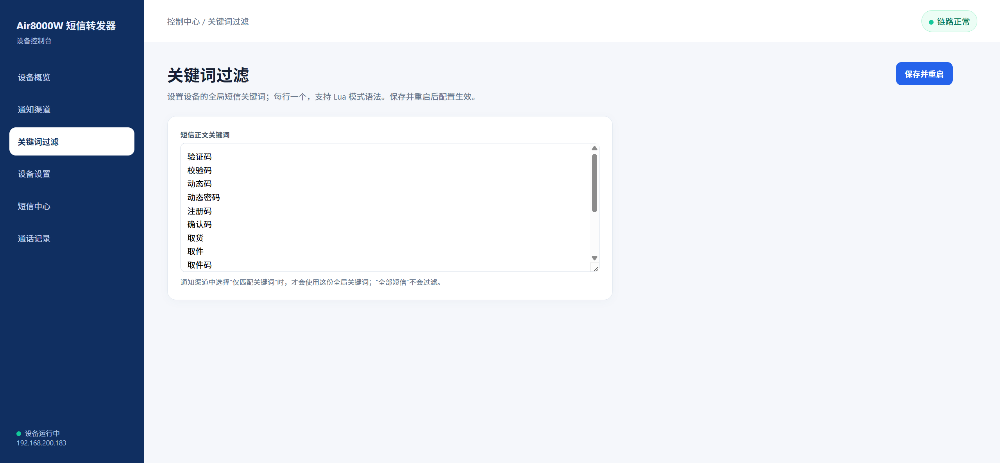
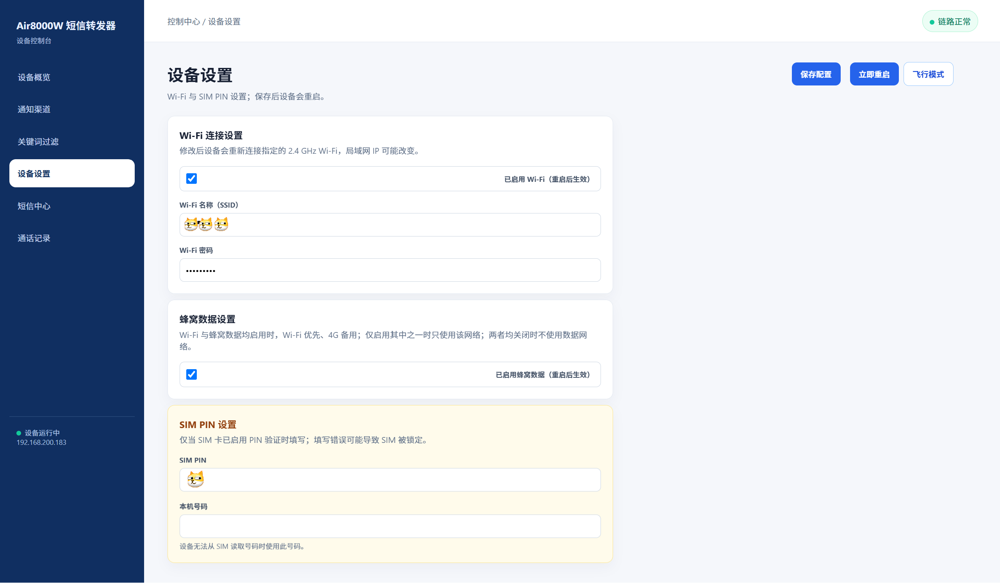
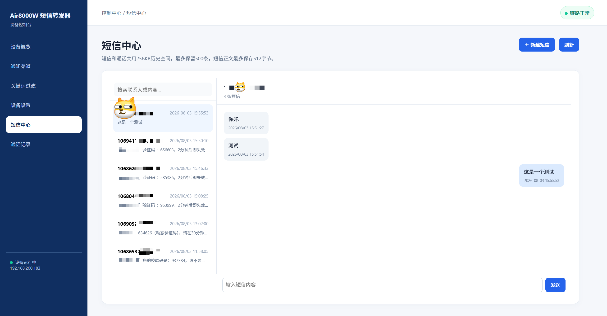
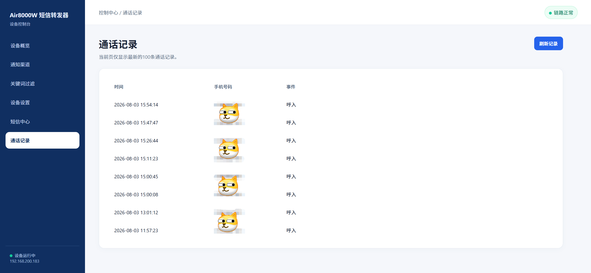
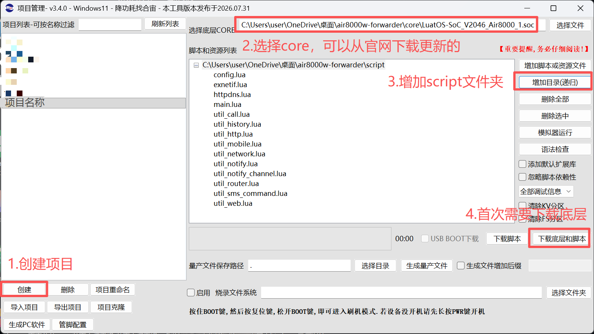
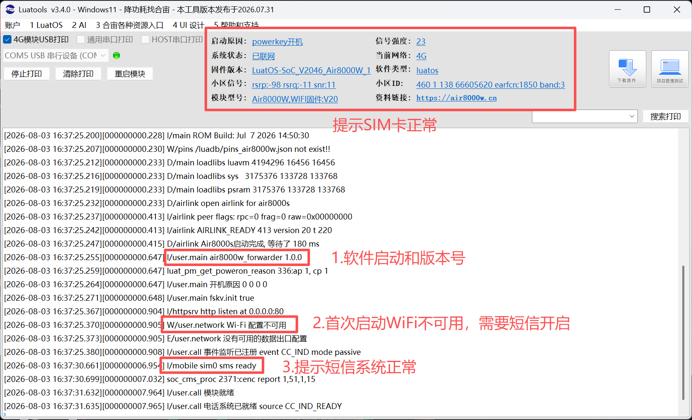

# air8000w-forwarder

Air8000W 的短信和通话事件转发项目。设备接收短信或通话状态后，可以通过 Wi-Fi/4G 将消息转发到 Bark、钉钉、飞书或自定义 Webhook。

## 功能概览

- 短信接收、筛选以及通过 Web 后台发送短信
- 来电、接通、挂断等通话事件通知（可按需启用）
- Wi-Fi 与 4G 网络配置
- Web 管理后台
- 通知失败重试和本地历史记录

## 管理后台概览













## 烧录演示





## 快速开始

### 准备

- 带 Air8000 芯片的硬件（需具备 SIM 卡槽、4G/Wi-Fi 天线）
- 已开通短信功能的 Nano-SIM 卡。若 SIM 卡启用了 PIN 验证，请先关闭 PIN，或在烧录前于 `script/config.lua` 中填写正确的 `PIN_CODE`；否则可能无法正常使用 SIM 卡
- 可传输数据的 USB Type-C 数据线（按硬件接口选择）
- Luatools 烧录工具（合宙官网下载）
- 2.4 GHz Wi-Fi（设备不支持 5 GHz）

### 1. 修改配置（非必须）

打开 [`script/config.lua`](script/config.lua)，按实际环境修改：

- Wi-Fi SSID 和密码
- SIM PIN（未启用 PIN 时留空）
- Web 管理端口和登录凭据
- 需要使用的通知渠道及其地址或凭据

完整配置项和默认值以该文件为准。配置文件可以不修改，直接刷入；首次启动后再通过 Wi-Fi 进入后台配置。

首次启动时内置通知渠道默认关闭，需要在 Web 后台启用渠道并填写对应的地址、密钥或 Webhook。

### 2. 使用 Luatools 烧录（请参考烧录演示图片）

1. 选择与 Air8000W 设备匹配的 LuatOS 固件。
2. 添加 `core/` 中的 SoC 固件文件。
3. 添加 `script/` 目录下的 Lua 文件。
4. 连接设备并开始烧录。

烧录完成后，观察串口日志，确认项目启动并且 SIM 卡已就绪。

### 3. 进入 Web 后台

设备连接 Wi-Fi 后，在串口日志或路由器 DHCP 列表中找到设备 IP，然后访问：

```text
http://设备IP:端口
```

默认端口为 80。例如：`http://192.168.1.101/`。如果修改了 Web 管理端口，请在地址中填写对应端口。

首次启动的默认登录凭据为 `admin` / `admin123`，部署前务必修改密码。Web 管理后台使用 HTTP 和 Basic Auth，请勿暴露到公网，只在可信局域网中使用。

如果未在 `script/config.lua` 中配置 Wi-Fi，需向设备所使用的 SIM 卡发送 Wi-Fi 控制短信：

```text
XTX,W,Wi-Fi名称,Wi-Fi密码
```
例如：
XTX,W,101_2.4G,12345678

设备保存配置后会自动重启并尝试连接 Wi-Fi。

该短信指令当前不校验发送号码。任何能够向设备 SIM 卡发送短信的号码，都可能修改 Wi-Fi 配置；如果不需要此功能，请在 `script/config.lua` 中将 `SMS_WIFI_COMMAND.enabled` 设置为 `false`。

## 项目目录

| 路径 | 用途 |
|------|------|
| `core/` | SoC 固件文件 |
| `script/` | Lua 应用脚本及配置 |
| `tests/` | Lua 测试脚本 |
| `pic/` | 项目演示图片 |

## 注意事项

- Web 后台保存网络相关配置后，需点击“立即重启”或手动重启设备才能生效。
- 设备 Web 后台默认使用 HTTP，请勿将设备直接暴露在公网。
- 设备仅支持连接 2.4 GHz Wi-Fi，不支持 5 GHz Wi-Fi。

## 测试

安装可用的 Lua 解释器后，在项目根目录执行。该测试为主机端逻辑测试，不在设备上运行：

```text
lua tests/run_all_tests.lua
```

## 更多信息

- 详细配置：[`script/config.lua`](script/config.lua)
- 具体功能实现：[`script/`](script/)
- 测试和行为示例：[`tests/`](tests/)
- 许可证：[`LICENSE`](LICENSE)
